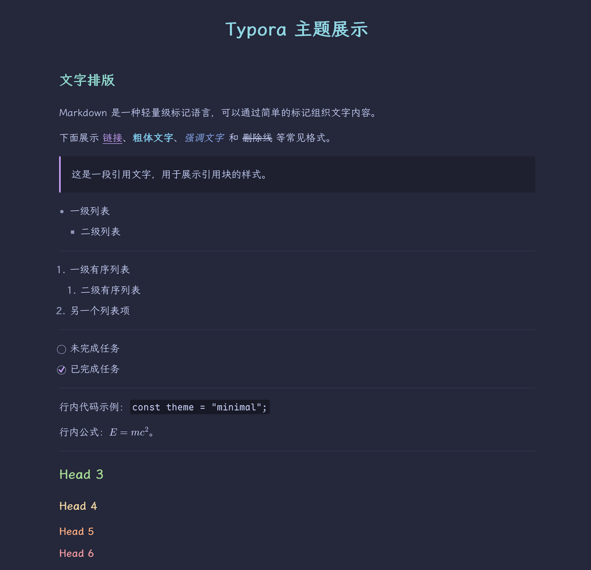
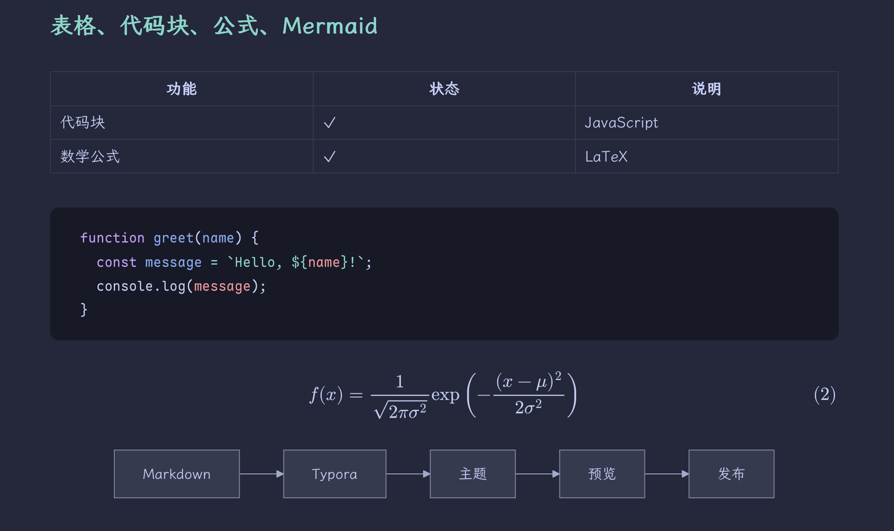

<h1 align="center">Alto Macchiato</h1>

为中文笔记与技术写作而作的 Typora 深色主题。

  <a href="#安装">安装</a> ·
  <a href="examples/showcase.md">示例文档</a>

Macchiato 的低饱和配色，搭配霞鹜文楷的中文正文与 Maple Mono 的等宽代码。适合写阅读笔记、整理技术文章。

## 格式展示

用 Typora 打开 [示例文档](examples/showcase.md)，可以集中查看这些样式。

## 安装

1. 在本仓库的 **Releases** 下载 `alto-macchiato-版本号-offline.zip`，然后解压。
2. 在 Typora 中进入 **设置 → 外观 → 打开主题文件夹**。
3. 将解压包 `theme/` 内的 **`alto-macchiato.css`** 和 **`alto-macchiato/`** 一起复制进去。
4. 重启 Typora，在“主题”菜单选择 **Alto Macchiato**。

字体已包含在安装包中，无需另外安装。建议从 **17 号字号**开始，再按自己的屏幕与阅读习惯调整。

GitHub 自动生成的 **Source code** 压缩包不含字体；请使用带 `-offline.zip` 的发布附件。升级、卸载与常见问题见 [使用指南](docs/INSTALL.md)。

基础样式已在 macOS / Typora 1.14.10 验证；本次字体精简尚待视觉复核。Windows、Linux 与打印／PDF 导出效果暂未验证。

## 致谢与许可

Alto Macchiato 基于 [Alto](https://github.com/Seeridia/typora-theme-alto) 与 [Lapis](https://github.com/YiNNx/typora-theme-lapis)，采用 [Catppuccin Macchiato](https://github.com/catppuccin/catppuccin) 配色，并搭配 [霞鹜文楷](https://github.com/lxgw/LxgwWenKai) 与 [Maple Mono](https://github.com/subframe7536/maple-font)。感谢这些项目的作者。

本项目的修改与脚本采用 [MIT License](LICENSE)；字体保留各自的 OFL 许可。完整的依赖关系与许可见 [来源说明](THIRD_PARTY_NOTICES.md)。
