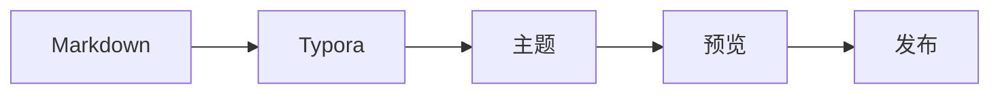

# Typora 主题展示

## 文字排版

Markdown 是一种轻量级标记语言，可以通过简单的标记组织文字内容。

下面展示 [链接](https://typora.io/)、**粗体文字**、*强调文字* 和 ~~删除线~~ 等常见格式。

> 这是一段引用文字，用于展示引用块的样式。

- 一级列表
  - 二级列表

---


1. 一级有序列表
   1. 二级有序列表
2. 另一个列表项

---

- [ ] 未完成任务
- [x] 已完成任务

---

行内代码示例：`const theme = "minimal";`

行内公式：$E = mc^2$。

---

### Head 3

#### Head 4

##### Head 5

###### Head 6

## 表格、代码块、公式、Mermaid

| 功能     | 状态 | 说明         |
| -------- | ---- | ------------ |
| 代码块   | ✓    | JavaScript   |
| 数学公式 | ✓    | LaTeX        |

```javascript
function greet(name) {
  const message = `Hello, ${name}!`;
  console.log(message);
}
````

$$
f(x)=\frac{1}{\sqrt{2\pi\sigma^2}} \exp\left(-\frac{(x-\mu)^2}{2\sigma^2}\right)
$$



